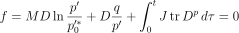
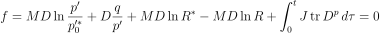
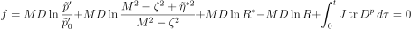

## JAX-based Simulation for Soils

### **Purpose**:

This project provides a simulation framework for modeling soil behavior under various stress conditions using the Cam-clay model and its extensions. It leverages JAX, a high-performance computing library, to perform parallel computations, enabling the simulation of multiple parameter sets simultaneously for comprehensive soil behavior analysis.

### **Key Features**:

- **Simultaneous Simulations**: Capable of running multiple simulations concurrently to analyze soil behavior under various stress conditions, optimizing computational efficiency.
- **Flexible Parameter Selection**: Users can specify multiple sets of parameters for each simulation, allowing extensive exploration of different soil properties and conditions.
- **High-Performance Computing**: Utilizes GPU/TPU acceleration to perform large-scale, high-speed computations.

### **Dependencies**

To run this project, you need to have the following Python libraries installed:

- `jax`: For high-performance numerical computing and machine learning. [Installation Guide](https://github.com/google/jax#installation)
- `jaxlib`: Companion library providing low-level linear algebra, FFT, and random number generation routines.
- `chex`: Utility functions and checks for JAX programs.

**Hardware Requirements**: A machine with GPU/TPU support is recommended for large-scale simulations to leverage JAX's full capabilities.

### Current Models				

The project includes several models designed for different soil conditions and behaviors:

1. **Cam-clay Model (Roscoe, 1963)**:

   - **Adapted geo-materials**: Normally consolidated clay, remolded clay, and loose sand.

   - **Yield Function**: 
     
     
     
     

     
     
     
<i>M</i>, <i>D</i>: Critical state parameters, where <i>M</i> is the slope of the critical state line, and <i>D</i> represents a related plastic characteristic parameter.
 
<i>J</i>: Jacobian determinant of the deformation gradient tensor, representing the volumetric deformation ratio.
<i>Dp</i>:represents the plastic components of stretching in the material's deformation.
<i>p</i>, <i>q</i>: Stress parameters, where <i>p</i> is the mean effective pressure, and <i>q</i> is the deviatoric stress (related to shear stress). 

     
   - **Reference**: https://doi.org/10.1680/geot.1963.13.3.211

2. **Subloading Surface Model (Hashiguchi, 1977)**:

   - **Adapted geo-materials**: Dense sand and clay with significant overconsolidation.

   - **Yield Function**:
     
     
     
     
     
     
<i>R</i>: characterize material overconsolidation 

     
   - **Reference**:  [https://doi.org/10.1016/0020-7683(89)90038-3](https://doi-org.kyoto-u.idm.oclc.org/10.1016/0020-7683(89)90038-3)
   
3. **Superloading Surface Model (Asaoka, 1998)**:

   - **Adapted geo-materials**:  Soils with overconsolidated history and inherent structure.

   - **Yield Function**: 
     
     
     
     
     
     

<i>R*</i>: characterize inherent structure 

     
   - **Reference**:  https://doi.org/10.3208/sandf.40.2_99

2. **Stress-Induced Anisotropy Model (Zhang, 2007)**:

   - **Adapted geo-materials**: Soils exhibiting cyclic mobility and liquefaction behavior.

   - **Yield Function**: 
   - 
     
     
     
     

<i>η*,ζ</i>: characterize stress-induced anisotropy 

     
     - **Reference**: [https://doi.org/10.3208/sandf.47.635](https://doi-org.kyoto-u.idm.oclc.org/10.3208/sandf.47.635)
     

### **Future Work and Expansions**

We plan to expand the model by incorporating additional equations and models to better represent complex soil behaviors. 

Contributions and suggestions for further development are welcome!